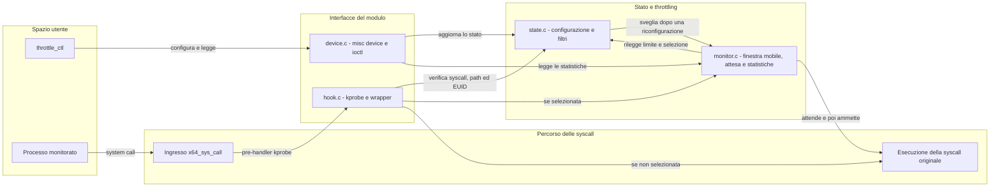

# Architettura

Il progetto e' diviso in una utility in spazio utente, un'interfaccia `ioctl`
e tre componenti principali nel modulo kernel. Il diagramma mostra sia il
percorso di configurazione sia quello seguito da una system call.

## Componenti

| Componente | Responsabilita' |
| --- | --- |
| `user/throttle_ctl.c` | Traduce i comandi dell'utente nelle operazioni `ioctl` e presenta configurazione e statistiche. |
| `include/syscall_throttle.h` | Definisce l'interfaccia condivisa, i limiti dei registri e le strutture scambiate con il kernel. |
| `kernel/device.c` | Registra `/dev/syscall_throttle`, verifica i permessi e inoltra ogni comando al componente appropriato. |
| `kernel/state.c` | Conserva configurazione, path, EUID e syscall registrate; decide se una chiamata deve essere controllata. |
| `kernel/hook.c` | Aggancia `x64_sys_call`, devia le chiamate selezionate nel wrapper e richiama il dispatcher originale. |
| `kernel/monitor.c` | Applica il limite globale con una finestra mobile, sospende i task e raccoglie le statistiche. |
| `kernel/module.c` | Coordina inizializzazione, cleanup degli errori e rimozione sicura del modulo. |

## Percorso di configurazione

1. `throttle_ctl` apre `/dev/syscall_throttle` e invia un comando `ioctl`.
2. `device.c` copia i dati provenienti dallo spazio utente e verifica i
   permessi. Le operazioni di modifica richiedono EUID 0, mentre le letture
   sono accessibili anche agli utenti normali.
3. `state.c` valida i valori, applica ogni operazione e incrementa la
   generazione quando cambia lo stato osservabile. Il comando utente
   `configure` disabilita il monitor ed esegue piu' ioctl in sequenza.
4. Una modifica rilevante sveglia la wait queue di `monitor.c`, cosi' i task in
   attesa possono rivalutare limite e filtri senza usare valori obsoleti.

## Percorso di una system call

1. La kprobe esegue il pre-handler all'ingresso di `x64_sys_call`.
2. Il pre-handler consulta `state.c` usando numero della syscall, posizione
   risolta dell'eseguibile ed EUID. Non dorme e non alloca memoria.
3. Una chiamata non selezionata continua normalmente nel dispatcher. Una
   chiamata selezionata viene invece deviata nel wrapper del modulo.
4. Il wrapper chiede l'ammissione a `monitor.c`. Se la finestra contiene gia'
   `MAX` timestamp, il task dorme sulla wait queue fino alla prima scadenza,
   a un segnale, a una riconfigurazione o all'arresto del modulo.
5. Dopo l'ammissione il wrapper richiama il dispatcher originale e restituisce
   al chiamante il suo risultato.

## Sincronizzazione e ciclo di vita

`state.c` protegge la configurazione con uno spinlock, perche' viene letta
anche dal pre-handler. `monitor.c` usa un mutex per buffer dei timestamp e
statistiche; tale lock viene acquisito soltanto dal wrapper, mai dalla kprobe.
La generazione atomica del monitor permette di riconoscere i risvegli dovuti a
una riconfigurazione.

Durante l'unload `hook.c` rimuove prima la kprobe, ferma il monitor e sveglia i
task sospesi. Il contatore `active_calls` e la relativa wait queue impediscono
di liberare il codice mentre un wrapper e' ancora attivo. Solo dopo il drain
`module.c` rimuove il device e libera le risorse del monitor.

Le motivazioni delle principali decisioni sono raccolte in
[Scelte di progetto](SCELTE_DI_PROGETTO.md).
